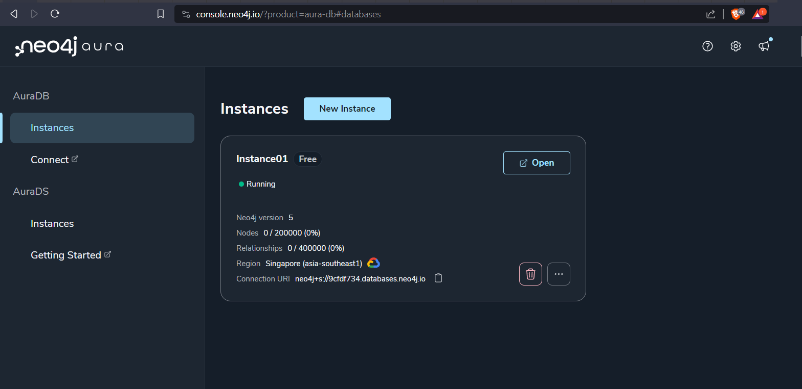
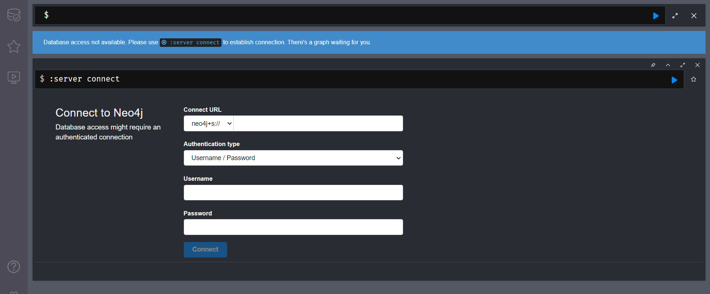

# EduEmbed Visualization

We will utilize Neo4j for visualizing the knowledge graph. Neo4j proves to be an excellent tool for visualizing the triples generated by EduEmbed.

## Prerequisites

Before following the procedure, make sure to:

- Register or log in to [Neo4j AuraDB](https://login.neo4j.com/u/signup/identifier?state=hKFo2SBqN2xMWEVtVzVSeEJqWm14ZkhnZ0FpZ01VT3YyWlJXa6Fur3VuaXZlcnNhbC1sb2dpbqN0aWTZIFFYbzNfbXF4aWlZVk5ZWEp1Ni1ncnlGdVY1Vi1RRVVio2NpZNkgV1NMczYwNDdrT2pwVVNXODNnRFo0SnlZaElrNXpZVG8).

## Dataset

You can obtain a sample dataset from https://github.com/Krutik-Patel/Triples/blob/main/triples_to_show.csv.

## Running the Visualization

Follow these steps to run the visualization:

1. Create a free instance of Neo4j AuraDB on the [Neo4j website](https://neo4j.com/aura/). Be sure to save and download the username and password.



2. Open [Neo4j Browser](https://browser.neo4j.io/) to visualize the knowledge graph.



3. Enter the Neo4j URL, username, and password for the database instance created in step 1.

4. Write queries to visualize the data. For more information, refer to the [Neo4j Docs](https://neo4j.com/docs/).

## Loading Data into the GraphDB

To load the triples into the GraphDB, follow these steps:

1. Load the data into the browser and create a list of head and value nodes (Make sure to get the raw CSV file link from GitHub).
```cypher
load csv with headers from "https://raw.githubusercontent.com/Krutik-Patel/Triples/main/triples.csv" as list
create (:head {name: list.head}), (:value {name: list.value});
```
2. Remove common nodes.
``` cypher
match (n)
with n.name AS name, COLLECT(n) AS nodelist, COUNT(*) AS count
where count > 1
call apoc.refactor.mergeNodes(nodelist,{
  properties:"combine",
  mergeRels:true
})
yield node
return node; 
```
3. Create relationships.
```cypher
load csv with headers from "https://raw.githubusercontent.com/Krutik-Patel/Triples/main/triples.csv" as list
match (HEAD:head {name: list.head}), (TAIL:value {name: list.value})
create (HEAD)-[:variable {name: list.variable, weight: list.prob}]->(TAIL);
```
4. Change the styling of the GraphDB.
``` cypher
:style relationship.variable {
    caption: "{name} {weight}";
}
``` 
## Example Queries

To visualize all the nodes in the GraphDB (Note: Neo4j Browser limits the number of nodes you can see at a time, see [Neo4j Browser Docs](https://neo4j.com/docs/browser-manual/current/)

``` cypher 
match (node) return node;
```

To limit the number of nodes displayed on your screen:

``` cypher
match (node) return node limit 1;
``` 
This query limits the number of nodes displayed to one.

For more information and advanced queries, refer to the [Neo4j Cypher Docs](https://neo4j.com/docs/cypher-manual/current/introduction/).